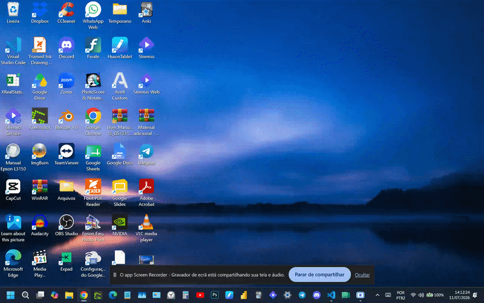

# 🤖 Automação de Cadastro de Produtos

Script em Python (RPA) que automatiza o cadastro de produtos em um sistema web, lendo os dados de uma planilha CSV e preenchendo o formulário automaticamente por meio de controle de mouse e teclado.

> Projeto desenvolvido como exercício prático de automação (RPA) com Python.

---

## 📌 Sobre o projeto

Empresas que precisam cadastrar grandes volumes de produtos manualmente perdem tempo e ficam sujeitas a erros de digitação. Este projeto resolve esse problema lendo os dados de uma planilha e preenchendo o sistema automaticamente, sem intervenção manual.

**O que o script faz, passo a passo:**

1. 🌐 Abre o navegador e acessa o sistema da empresa
2. 🔑 Realiza login automaticamente
3. 📊 Lê os dados de produtos de um arquivo `produtos.csv`
4. ✍️ Preenche o formulário de cadastro para cada produto: código, marca, tipo, categoria, preço unitário, custo e observação
5. 🔁 Repete o processo automaticamente para os produtos da planilha
6. 🛑 Pode ser interrompido a qualquer momento apertando a tecla **ESC**



## 🛠️ Tecnologias e bibliotecas utilizadas

- **Python 3**
- [`pyautogui`](https://pyautogui.readthedocs.io/) — controle automatizado de mouse e teclado
- [`pandas`](https://pandas.pydata.org/) — leitura e manipulação da planilha de produtos
- [`keyboard`](https://github.com/boppreh/keyboard) — captura da tecla ESC para interromper o script
- [`screeninfo`](https://pypi.org/project/screeninfo/) — identifica os monitores conectados
- [`pygetwindow`](https://pypi.org/project/PyGetWindow/) — localiza e move a janela do navegador entre monitores
- `time` — controle de pausas entre as ações
- `openpyxl` — suporte à leitura de arquivos Excel pelo pandas

---

## ▶️ Como executar o projeto

### 1. Instale as dependências

```bash
pip install pyautogui pandas openpyxl keyboard screeninfo pygetwindow
```

### 2. Prepare o arquivo de dados

Coloque um arquivo `produtos.csv` na mesma pasta do script, com as seguintes colunas:

| codigo | marca | tipo | categoria | preco_unitario | custo | obs |
|--------|-------|------|-----------|-----------------|-------|-----|

### 3. Ajuste as coordenadas de tela

As posições de clique (`pyautogui.click(x=..., y=...)`) foram mapeadas para uma resolução e um layout de tela específicos. Antes de rodar, ajuste essas coordenadas para a sua própria tela e para o site em que for usar.

### 4. Execute o script

```bash
python codigoaula1.py
```

### 5. Para interromper a qualquer momento

Pressione **ESC**. O script escuta essa tecla em segundo plano e para com segurança após concluir o cadastro do produto em andamento.

---

## ⚙️ Funcionalidades de segurança

- ✅ **Parada de emergência com ESC**: o script escuta a tecla ESC em segundo plano durante toda a execução, permitindo interromper o processo a qualquer momento, mesmo durante pausas (`time.sleep`)
- ✅ **Failsafe nativo do PyAutoGUI**: mover o mouse rapidamente até o canto superior esquerdo da tela interrompe a execução instantaneamente
- ✅ **Rolagem automática**: após cada cadastro, a página retorna ao topo (`Ctrl+Home`) para que o próximo produto seja preenchido a partir do mesmo ponto de referência
- ✅ **Abertura inteligente do navegador em setups com múltiplos monitores**: o script identifica em qual monitor o VS Code está sendo executado e abre o Chrome automaticamente no monitor oposto, evitando que a automação interfira na tela onde o código está sendo editado

---

## 📁 Estrutura dos arquivos

| Arquivo | Descrição |
|---|---|
| `codigoaula1.py` | Script principal da automação |
| `auxiliaraula1.py` | Script auxiliar para identificar coordenadas de clique na tela |
| `esc_teste.py` | Script de teste isolado para validar a captura da tecla ESC |
| `produtos.csv` | Planilha de exemplo com os dados dos produtos a serem cadastrados |

---

## 👩‍💻 Autora

Desenvolvido por **Glaucia Fumes Chaguri**  
Projeto de estudo em automação de processos (RPA) com Python.

